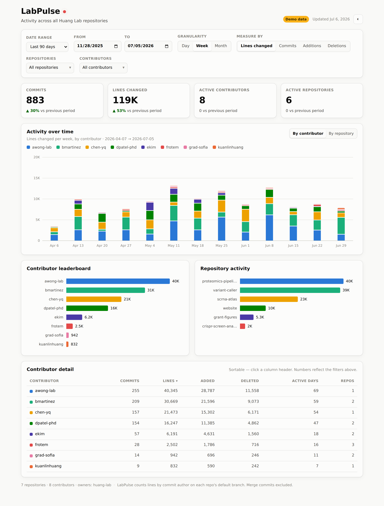

# LabPulse 📈

A simple, self-hosted dashboard that tracks activity across **every Huang Lab
repository** — including repos created after setup — and breaks it down by
contributor, by **commits** and **lines changed**, over **day / week / month**.
Built to make it easy to see who's shipping what and keep everyone accountable.

- **Zero infrastructure.** A scheduled GitHub Action fetches the data and
  publishes a static site to GitHub Pages. Nothing to host or pay for.
- **Auto-discovers repos.** Every run lists all repos for the configured
  owner(s), so new repositories show up on their own.
- **Contributor-level detail.** Commits, lines added/deleted, active days, and
  repos touched — per person, filterable by repo, contributor, and date range.



> The repo ships with **demo data** so the dashboard renders immediately (look
> for the "Demo data" badge). Your first real fetch replaces it.

---

## How it works

```
config.json ──▶ scripts/fetch_activity.py ──▶ public/data/activity.json ──▶ public/ (static SPA)
   owners            (GitHub REST API,              daily aggregates          index.html + app.js
   & options          incremental cache)            per repo/author/day        rendered in the browser
```

1. **`scripts/fetch_activity.py`** (Python 3, no dependencies) lists all repos
   for each owner, walks each repo's default-branch commits, records per-commit
   line stats, and writes a compact dataset aggregated to **one row per repo,
   per author, per day**. It's incremental — a per-repo cache means each run
   only fetches commits it hasn't seen.
2. **`public/`** is a dependency-free single-page dashboard that reads that JSON
   and does day/week/month rollups, filtering, and charting in the browser.
3. **`.github/workflows/refresh-data.yml`** runs the fetch daily and publishes
   `public/` to GitHub Pages (a `github.io` URL). It can also be adapted to commit
   the data back for other static hosts like Vercel — see the note in Setup.

---

## Setup (≈5 minutes)

### 1. Point it at your lab's GitHub owner(s)

Edit **`config.json`**:

```json
{ "owners": ["huang-lab"] }
```

`owners` can list organizations **and/or** user accounts. If some lab repos live
under a personal account, add it too, e.g. `["huang-lab", "kuanlinhuang"]`.

### 2. Add a token so it can read all your repos

The default `GITHUB_TOKEN` inside Actions can only read *this* repo. To scan the
whole org (and any private repos), create a Personal Access Token and add it as a
secret:

1. Create a token — either works:
   - **Fine-grained** (recommended): *Settings → Developer settings → Fine-grained
     tokens*. Resource owner = your org, Repository access = **All repositories**,
     Permissions → Repository → **Contents: Read-only** and **Metadata: Read-only**.
   - **Classic**: scope **`repo`** (and **`read:org`** for private org repos).
2. In this repository: *Settings → Secrets and variables → Actions → New
   repository secret*. Name it **`LABPULSE_TOKEN`**, paste the token.

### 3. Enable GitHub Pages

*Settings → Pages → Build and deployment → Source = **GitHub Actions***. (Free for
public repos; private repos need a paid GitHub plan — see the Vercel note below.)

### 4. Run it

*Actions → "Refresh LabPulse data" → Run workflow.* The workflow fetches all your
org's activity **and** publishes the dashboard to GitHub Pages in one go. When it
finishes, the URL is shown on the run's **deploy** job and under *Settings → Pages*
— typically `https://<org>.github.io/<repo>/` (e.g.
`https://huang-lab.github.io/LabPulse/`). After this it refreshes every day on its
own; new repos appear automatically.

> **Prefer Vercel (e.g. to keep the repo private)?** `public/` is a plain static
> site. Import the repo at [vercel.com](https://vercel.com) — it reads
> `vercel.json` (Output Directory `public`, no build). For that path, have the
> workflow commit the data back instead of deploying Pages (earlier git history of
> `refresh-data.yml` has that variant), so Vercel redeploys on each data commit.
> A free Vercel URL is reachable by anyone with the link (password protection is a
> paid feature).

---

## Run it locally

```bash
# 1. Generate demo data (optional — just to preview the UI)
python3 scripts/make_sample_data.py

# 2. Or fetch real data (needs a token with org read access)
export LABPULSE_TOKEN=ghp_xxx
python3 scripts/fetch_activity.py

# 3. Serve the dashboard
cd public && python3 -m http.server 8099
# open http://localhost:8099
```

---

## Configuration reference (`config.json`)

| Key | Default | What it does |
|---|---|---|
| `owners` | `["huang-lab"]` | Orgs and/or users to scan. All their repos are included. |
| `branch` | `"default"` | Branch to count per repo. `"default"` uses each repo's default branch, or set a specific name. |
| `since` | `null` | ISO date (`"2024-01-01"`) to limit how far back to read. `null` = full history. |
| `include_forks` | `false` | Count forked repos. |
| `include_archived` | `true` | Count archived repos (historical work still shows). |
| `include_merge_commits` | `false` | Count merge commits (usually inflates line counts). |
| `exclude_repos` | `[]` | Repo names or `owner/name` to skip. |
| `exclude_authors` | bots | Logins/names to drop (bots by default). |
| `author_aliases` | `{}` | Merge identities: `{ "alice": ["alice@old.edu", "alice-phd"] }` folds all listed logins/emails/names into `alice`. |
| `max_lines_per_commit` | `null` | Ignore commits changing more than N lines (drops vendored/generated blobs). |
| `max_commit_details_per_run` | `4000` | API budget per run. A large first-time backfill finishes over several scheduled runs; the cache preserves progress. |

---

## How work is measured

- **Attribution** is by the commit **author** (who wrote it), on each repo's
  **default branch**, using the authored date.
- **Lines changed** = additions + deletions from GitHub's per-commit stats.
  "Additions" and "Deletions" are also available as separate measures.
- **Merge commits are excluded** by default (they double-count merged work).
- Commits from authors with **no linked GitHub account** are grouped by their
  git name/email; use `author_aliases` to merge someone's multiple identities.
- Line counts reflect *volume of change*, which is a rough proxy for effort — a
  refactor that deletes 2,000 lines is real work; a committed data file is not.
  Read the leaderboard alongside commits and active days, not on its own.

---

## Project layout

```
config.json                         # who/what to scan
scripts/fetch_activity.py           # data fetcher (stdlib only)
scripts/make_sample_data.py         # demo-data generator
public/index.html · styles.css · app.js   # the dashboard
public/data/activity.json           # generated dataset (demo data committed)
.github/workflows/refresh-data.yml        # scheduled fetch → deploy to GitHub Pages
vercel.json                               # optional: static-host config for Vercel
```
